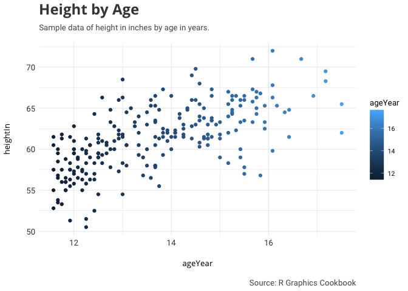
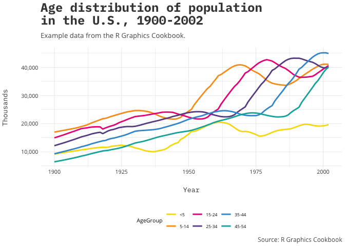

# awtools
# a_theme
A simple, distilled, #rstats theme used mainly on [www.austinwehrwein.com](http://austinwehrwein.com/)

This theme uses fonts that can be found and downloaded from Google Fonts:

 - [Slabo 27px](https://fonts.google.com/specimen/Slabo+27px) (plot title, legend)
 - [PT Sans Narrow](https://fonts.google.com/specimen/PT+Sans+Narrow) (subtitle, captions, axis_text)
 
 # Examples
Here is a simple scatterplot

```r
#devtools::install_github('awhstin/awtools')
library(awtools)
library(gcookbook)
library(ggplot2)

ggplot(heightweight,aes(x=ageYear,y=heightIn,color=ageYear))+
  geom_point()+
  a_theme()+
  labs(title='Height by Age',
       subtitle='Sample data of height in inches by age in years.',
       caption='Source: R Graphics Cookbook')
```

<!-- -->
 
Here is an example of the color palette

```r
ggplot(uspopage, aes(x=Year, y=Thousands, fill=AgeGroup)) + 
  geom_area() +
  a_scale_fill() +
  scale_y_continuous(labels = scales::comma)+
  labs(title="Age distribution of population\nin the U.S., 1900-2002",
       subtitle="Example data from the R Graphics Cookbook.",
       caption="Source: R Graphics Cookbook") +
  a_theme() +
  theme(legend.position="bottom")
```

<!-- -->

