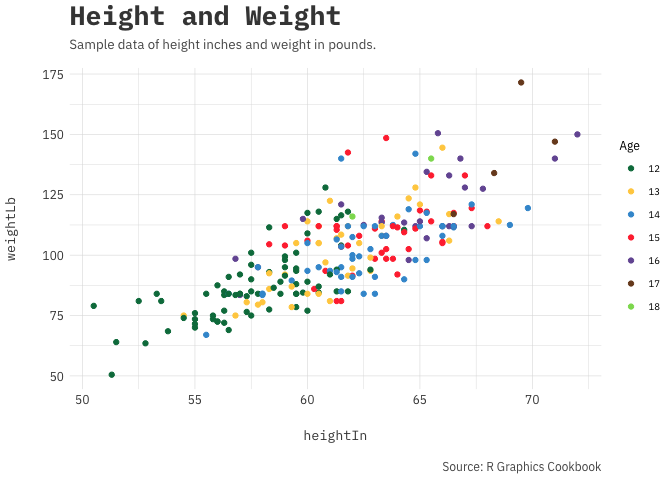
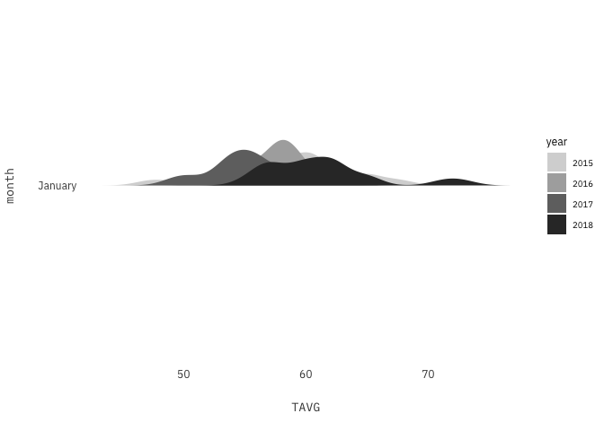
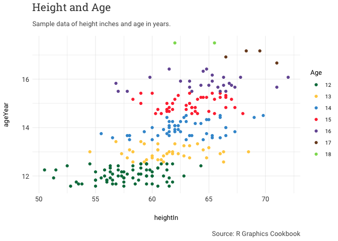

a\_theme
========

A simple, distilled, \#rstats theme used mainly on [www.austinwehrwein.com](https://austinwehrwein.com/)

My main theme now is the <code>a\_plex\_theme</code> which the fonts are available from Google Fonts:

-   [IBM Plex Mono](https://fonts.google.com/specimen/IBM+Plex+Mono) (plot title, legend)
-   [Open Sans](https://fonts.google.com/specimen/Open+Sans) (subtitle, captions, axis\_text)

The original <code>a\_theme</code> uses fonts that can be found and downloaded from Google Fonts:

-   [Roboto](https://fonts.google.com/specimen/Slabo+27px) (plot title, legend)
-   [Open Sans](https://fonts.google.com/specimen/Open+Sans) (subtitle, captions, axis\_text)

The new <code>a\_robot\_theme</code> uses fonts that can be found and downloaded from Google Fonts:

-   [Roboto Slab](https://fonts.google.com/specimen/Roboto+Slab) (plot title, legend)
-   [Roboto Light](https://fonts.google.com/specimen/Roboto) (subtitle, captions, axis\_text)

The new <code>a\_concert\_theme</code> uses fonts that can be found and downloaded from Google Fonts:

-   [Concert One](https://fonts.google.com/specimen/Concert+One) (plot title, axis\_title)
-   [Inconsolata](https://fonts.google.com/specimen/Inconsolata) (subtitle, captions, axis\_text)

New Examples
------------

#### a\_plex\_theme features:

-   grid: \[TRUE/FALSE\] turns off the main panel grids.
-   noaxis: \[TRUE/FALSE\] turns off the axis of the plot, seen mainly in maps.
-   emphasis: \['x','y','xy'\] adds a bold to an axis title for emphasis.

A new update to the awtools package sees a dark theme and grays palette.

``` r
groups<-unique(uspopage$AgeGroup)
uspopage<-uspopage%>%
  filter(uspopage$AgeGroup %in% head(groups,6))
ggplot(uspopage, aes(x=Year, y=Thousands, color=AgeGroup)) + 
  geom_line(size=1) +
  a_primary_color() +
  scale_y_continuous(labels = scales::comma)+
  labs(title="Age distribution of population\nin the U.S., 1900-2002",
       subtitle="Example data from the R Graphics Cookbook.",
       caption="Source: R Graphics Cookbook") +
  a_plex_theme() +
  theme(legend.position="bottom")
```


A new update to the awtools package sees a new dark theme that is based on the main plex theme.

``` r
ggplot(uspopage, aes(x=Year, y=Thousands, color=AgeGroup)) + 
  geom_line(size=1) +
  a_main_color() +
  scale_y_continuous(labels = scales::comma)+
  labs(title="Age distribution of population\nin the U.S., 1900-2002",
       subtitle="Example data from the R Graphics Cookbook.",
       caption="Source: R Graphics Cookbook") +
  a_dark_theme() +
  theme(legend.position="bottom")
```



And a new <code>a\_gray\_color</code> and <code>a\_gray\_palette</code> which is a simple four color grays palette.

``` r
lax<-read_csv('https://raw.githubusercontent.com/awhstin/temperaturesv2/master/LAX-NCDC-2015-18.csv') %>% 
  filter(months(DATE)=='January')%>%
  mutate(year=format(DATE,'%Y'),
         month=factor(months(DATE), levels=rev(month.name)))
```

    ## Parsed with column specification:
    ## cols(
    ##   STATION = col_character(),
    ##   NAME = col_character(),
    ##   DATE = col_date(format = ""),
    ##   AWND = col_double(),
    ##   PGTM = col_character(),
    ##   PRCP = col_double(),
    ##   SNOW = col_character(),
    ##   SNWD = col_character(),
    ##   TAVG = col_integer(),
    ##   TMAX = col_integer(),
    ##   TMIN = col_integer(),
    ##   WDF2 = col_integer(),
    ##   WDF5 = col_integer(),
    ##   WSF2 = col_double(),
    ##   WSF5 = col_double()
    ## )

``` r
ggplot(lax, aes(x=TAVG, y=month, fill=year)) +
  geom_density_ridges(scale=.9, color=NA) +
  a_plex_theme(grid=FALSE) +
  a_gray_fill()
```

    ## Picking joint bandwidth of 1.23


``` r
ggplot(uspopage, aes(x=Year, y=Thousands, color=AgeGroup)) + 
  geom_line(size=1) +
  a_main_color() +
  scale_y_continuous(labels = scales::comma)+
  labs(title="Age distribution of population\nin the U.S., 1900-2002",
       subtitle="Example data from the R Graphics Cookbook.",
       caption="Source: R Graphics Cookbook") +
  a_dark_theme() +
  theme(legend.position="bottom")
```



Old examples
------------

Here is a simple scatterplot with the original <code>a\_theme</code>.

``` r
ggplot(heightweight,aes(x=ageYear,y=heightIn,color=ageYear))+
  geom_point()+
  a_theme()+
  labs(title='Height by Age',
       subtitle='Sample data of height in inches by age in years.',
       caption='Source: R Graphics Cookbook')
```


Here is an example of the color palette.

``` r
ggplot(uspopage, aes(x=Year, y=Thousands, fill=AgeGroup)) + 
  geom_area() +
  a_scale_fill() +
  scale_y_continuous(labels = scales::comma)+
  labs(title="Age distribution of population\nin the U.S., 1900-2002",
       subtitle="Example data from the R Graphics Cookbook.",
       caption="Source: R Graphics Cookbook") +
  a_theme() +
  theme(legend.position="bottom")
```



I also created a reverse of the color palette which is debuted along with the 'a\_robot\_theme'.

``` r
ggplot(uspopage, aes(x=Year, y=Thousands, fill=AgeGroup)) + 
  geom_area() +
  a_reversed_fill() +
  scale_y_continuous(labels = scales::comma)+
  labs(title="Age distribution of population\nin the U.S., 1900-2002",
       subtitle="Example data from the R Graphics Cookbook.",
       caption="Source: R Graphics Cookbook") +
  a_robot_theme() +
  theme(legend.position="bottom")
```


Finally for work I compare 4 and 6 factors often so I created a stepped version of my color palette.

I also created a reverse of the color palette which is seen below. There has been some work that requires a slightly more editorial style graph so here is also the debut of the 'a\_concert\_theme'.

``` r
groups<-unique(uspopage$AgeGroup)
uspopages<-uspopage%>%
  filter(uspopage$AgeGroup %in% head(groups,4))
ggplot(uspopages, aes(x=Year, y=Thousands, fill=AgeGroup)) + 
  geom_area() +
  a_step_fill() +
  scale_y_continuous(labels = scales::comma)+
  labs(title="Age distribution of population\nin the U.S., 1900-2002",
       subtitle="Example data from the R Graphics Cookbook.",
       caption="Source: R Graphics Cookbook") +
  a_concert_theme() +
  theme(legend.position="bottom")
```


Finally a little display of a new color palette.

``` r
groups<-unique(uspopage$AgeGroup)
uspopage<-uspopage%>%
  filter(uspopage$AgeGroup %in% head(groups,6))
ggplot(uspopage, aes(x=Year, y=Thousands, color=AgeGroup)) + 
  geom_line(size=1) +
  a_main_color() +
  scale_y_continuous(labels = scales::comma)+
  labs(title="Age distribution of population\nin the U.S., 1900-2002",
       subtitle="Example data from the R Graphics Cookbook.",
       caption="Source: R Graphics Cookbook") +
  a_concert_theme() +
  theme(legend.position="bottom")
```


