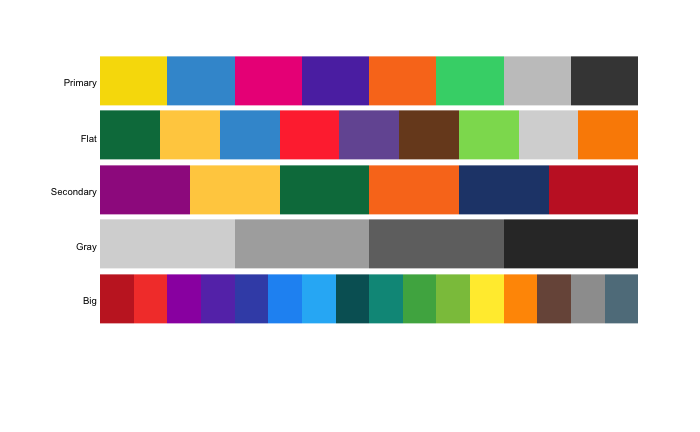
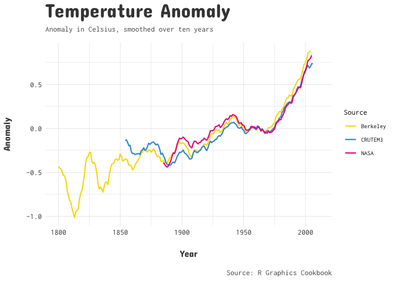

[](http://www.repostatus.org/#active)

awtools
=======

A simple, distilled, \#rstats theme used mainly on
[www.austinwehrwein.com](https://austinwehrwein.com/)

The main theme is the <code>a\_plex\_theme</code> which the fonts are
available from Google Fonts:

-   [IBM Plex Mono](https://fonts.google.com/specimen/IBM+Plex+Mono)
    (plot title, legend)
-   [IBM Plex Sans](https://fonts.google.com/specimen/IBM+Plex+Sans)
    (subtitle, captions, axis\_text)

<code>a\_dark\_theme</code> shares mostly all the same elements of the
main theme but the colors are adjusted to make a dark theme.

Examples
--------

<code>a\_plex\_theme</code> features: 
- grid: \[TRUE/FALSE\] turns off the main panel grids. 
- noaxis: \[TRUE/FALSE\] turns off the axis of the plot, seen mainly in maps. 
- emphasis: \[‘x’,‘y’,‘xy’\] adds a bold to an axis title for emphasis.

Palettes
--------

``` r
pal.bands(ppalette,mpalette,spalette,gpalette,labels = c('Primary','Flat','Secondary','Gray'))
```



An example using the <code>a\_plex\_theme</code> with the
<code>a\_flat\_color</code> palette.

``` r
ggplot(heightweight,aes(x=heightIn,y=weightLb, color = factor(round(ageYear)))) + 
  geom_point() +
  a_plex_theme() +
  a_flat_color() +
  labs(
    title='Height and Weight',
    subtitle='Sample data of height inches and weight in pounds.',
    caption='Source: R Graphics Cookbook',
    color='Age'
  )
```


Example of <code>a\_dark\_theme</code> with the primary color palette.

``` r
ggplot(mtcars, aes(mpg, wt)) +
  geom_point(aes(color=factor(carb), size=drat)) +
  labs(x="Fuel efficiency (mpg)", y="Weight (tons)",
       title="Basic scatterplot example",
       subtitle="A demonstration",
       caption="This be a caption") + 
  a_primary_color() +
  a_dark_theme()
```


And a new <code>a\_gray\_color</code> and <code>a\_gray\_palette</code>
which is a simple four color grays palette.

``` r
lax<-read_csv('https://raw.githubusercontent.com/awhstin/temperaturesv2/master/LAX-NCDC-2015-18.csv') %>% 
  filter(months(DATE)=='January')%>%
  mutate(year=format(DATE,'%Y'),
         month=factor(months(DATE), levels=rev(month.name)))
```

    ## Parsed with column specification:
    ## cols(
    ##   STATION = col_character(),
    ##   NAME = col_character(),
    ##   DATE = col_date(format = ""),
    ##   AWND = col_double(),
    ##   PGTM = col_logical(),
    ##   PRCP = col_double(),
    ##   SNOW = col_logical(),
    ##   SNWD = col_logical(),
    ##   TAVG = col_double(),
    ##   TMAX = col_double(),
    ##   TMIN = col_double(),
    ##   WDF2 = col_double(),
    ##   WDF5 = col_double(),
    ##   WSF2 = col_double(),
    ##   WSF5 = col_double()
    ## )

``` r
ggplot(lax, aes(x=TAVG, y=month, fill=year)) +
  geom_density_ridges(scale=.9, color=NA) +
  a_plex_theme(grid=FALSE) +
  a_gray_fill()
```

    ## Picking joint bandwidth of 1.23


Old
---
The original <code>a\_theme</code> uses fonts that can be found and
downloaded from Google Fonts:

-   [Roboto](https://fonts.google.com/specimen/Slabo+27px) (plot title,
    legend)
-   [Open Sans](https://fonts.google.com/specimen/Open+Sans) (subtitle,
    captions, axis\_text)

The new <code>a\_robot\_theme</code> uses fonts that can be found and
downloaded from Google Fonts:

-   [Roboto Slab](https://fonts.google.com/specimen/Roboto+Slab) (plot
    title, legend)
-   [Roboto Light](https://fonts.google.com/specimen/Roboto) (subtitle,
    captions, axis\_text)

The new <code>a\_concert\_theme</code> uses fonts that can be found and
downloaded from Google Fonts:

-   [Concert One](https://fonts.google.com/specimen/Concert+One) (plot
    title, axis\_title)
-   [Inconsolata](https://fonts.google.com/specimen/Inconsolata)
    (subtitle, captions, axis\_text)

Here is a simple scatterplot with the original <code>a\_theme</code>.

``` r
ggplot(heightweight,aes(x=ageYear,y=heightIn, color=sex))+
  geom_point()+
  a_theme()+
  a_scale_color() +
  labs(title='Height by Age',
       subtitle='Sample data of height in inches by age in years.',
       caption='Source: R Graphics Cookbook')
```


<code>a\_robot\_theme</code> gets the name from the use of Roboto and
Roboto Slab for the base and plot title fonts.

``` r
ggplot(heightweight,aes(x=heightIn,y=ageYear, color = factor(round(ageYear)))) + 
  geom_point() +
  a_robot_theme() +
  a_flat_color() +
  labs(
    title='Height and Age',
    subtitle='Sample data of height inches and age in years.',
    caption='Source: R Graphics Cookbook',
    color='Age'
  )
```


The <code>a\_concert\_theme</code> was developed for a more editorial
style visualization.

``` r
ggplot(climate,aes(x=Year,y=climate$Anomaly10y, color=Source)) + 
  geom_line(size=.75) +
  a_concert_theme() +
  a_primary_color() +
  labs(
    title='Temperature Anomaly',
    subtitle='Anomaly in Celsius, smoothed over ten years',
    caption='Source: R Graphics Cookbook',
    y='Anomaly'
  )
```


